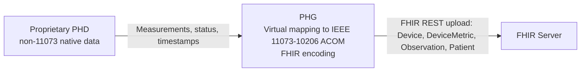

Not all PHDs are using a protocol such as GHS that is based upon the 11073-10206 ACOM standard. This IG also supports Bluetooth devices that follow various Bluetooth SIG defined personal health device profiles and services. However, this requires that the information provided by the device can be mapped to IEEE 11073-10206 ACOM System Information, Power, Clock, and Observation objects by the PHG as specified in the transcoding white paper (the latest version can be found [here](https://www.bluetooth.com/bluetooth-resources/personal-health-devices-transcoding/)) when the generated observations are going to be uploaded to a FHIR server. The requirement does not mandate that the PHG actually create these objects, but the resulting FHIR resources have to be composed as if they had come from an  IEEE 11073-10206 ACOM compliant PHD device supporting the same type of observations.

The transcoding requirements put further demands on the Bluetooth PHD device over and above that specified in the Bluetooth SIG PHD specifications. For example, the Bluetooth Health Thermometer Profile does not require that a thermometer is able to report its sense of current time even though it may report timestamps in the measurements. Because PHDs often have unreliably set clocks, a PHD that generates measurements with timestamps should provide a means for the PHG to determine the PHD's current time and clock status information, such as its synchronization state. With this information the PHG can correct the PHD's timestamps or anchor them to its own timeline.

Note that in the absence of sufficient time status information from the PHD, the PHG will not be able to reliably place the observations on a UTC plus time-zone offset timeline. In that case the PHG may choose to assume the received observations are from the PHD's current timeline and apply the mapping given in the [PhdBaseObservation profile](StructureDefinition-PhdBaseObservation.html) for a current but unsynchronized clock (Current = Yes, Synced = No), mapping the timestamps to the PHG timeline including the PHG offset.

In addition to PHDs implementing GHS or another Bluetooth PHD profile, there are numerous proprietary medical devices on the market. It may be possible to map the measurements coming from these devices to the PHD profiles from this IG, but that mapping would require that the resulting FHIR resources be created and populated as if they had come from an IEEE 11073-10206 ACOM compliant device. The writers of this guide have performed this task for a number of proprietary Serial Port Protocol (SPP) and Bluetooth SIG PHD devices.

In this Implementation Guide, the PHD is treated as a IEEE 11073-10206 ACOM compliant device. When working with other device types, it is the responsibility of the FHIR encoder to 'virtually' map the data from the device to the IEEE 11073-10206 model when generating the PHD FHIR resources. Typically this encoding is done in the PHG, but it could be done in the PHD if the device is capable of generating FHIR resources directly. The FHIR resources generated by the PHG or PHD must be composed as if they had come from an IEEE 11073-10206 ACOM compliant device supporting the same type of observations.

### Proprietary PHD to FHIR data flow
The diagram below illustrates a proprietary PHD sending measurements to a PHG, where the virtual IEEE 11073-10206 mapping and FHIR encoding are performed before upload to a FHIR server.

